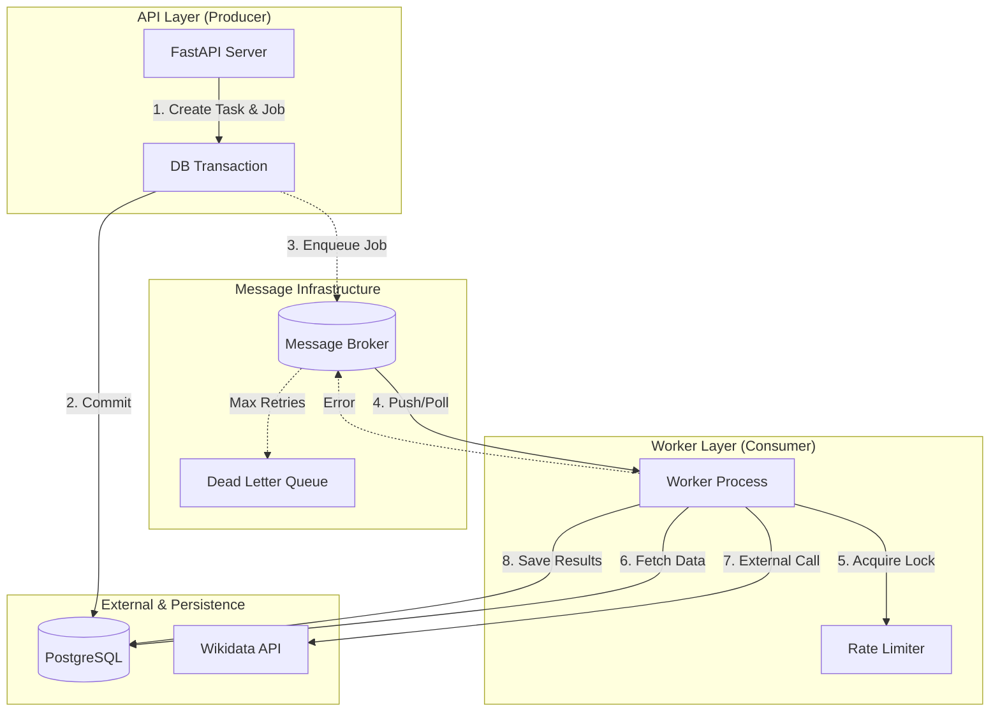

# Background Processing Architecture (Detailed)

> **Status**: Draft
> **Phase**: 6+ Implementation Guide
> **Scope**: Asynchronous Task Processing & Data Pipelines

## 1. Executive Summary

This document defines the architectural standard for background processing in the Record Linker system. It mandates a **Message-Driven Architecture** to ensure:
- **Resilience**: Failures in external systems (Wikidata) do not crash the application.
- **Scalability**: High-volume matching (10k+ records) is distributed across multiple workers.
- **Responsiveness**: User requests are accepted immediately (`202 Accepted`), while processing happens asynchronously.

---

## 2. Architecture Overview

The system implements a **Producer-Consumer** model with strict separation of concerns.



### 2.1 Component Responsibilities

| Component | Responsibility | Failure Mode |
|-----------|----------------|--------------|
| **Producer (API)** | Validates input, creates DB record (pending state), and enqueues job. | Returns user error (4xx) or server error (5xx) if enqueue fails. |
| **Broker** | Durably stores messages. Handles routing and priorities. | Persists messages to disk. Clusters for HA. |
| **Consumer (Worker)** | Executes logic. Manages local state (ACK/NACK). | Restarts automatically. Messages remain in queue (timeout). |
| **Dead Letter Queue (DLQ)** | "Graveyard" for unprocessable messages to prevent infinite loops. | Requires manual operator intervention / replay. |

---

## 3. The Job Protocol

Jobs are **self-contained units of work**. A worker should theoretically be able to execute a job with no shared memory from the producer.

### 3.1 Job Envelope Schema

Every message payload must adhere to this strict structure:

```json
{
  "header": {
    "job_id": "uuid4-correlation-id",
    "type": "entity.match",
    "version": "1.0",
    "created_at": "2024-12-24T12:00:00Z",
    "attempt": 1,
    "max_attempts": 3
  },
  "body": {
    "project_id": 50,
    "task_id": 1024,
    "dataset_entry_id": 500
  },
  "tracing": {
    "trace_id": "0af7651916cd43dd8448eb211c80319c",
    "span_id": "b7ad6b7169203331"
  }
}
```

### 3.2 Design Rules
1.  **Small Payloads**: Do not send the *data* (e.g., the 50MB CSV file content) in the message. Send references (`file_path`, `entry_id`).
2.  **Idempotency Keys**: Use `task_id` as a natural idempotency key. Processing `task_id=1024` twice should verify the status before re-running.

---

## 4. Workflows & Data Consistency

### 4.1 The "Happy Path": Task Matching

1.  **User Action**: User requests "Match Project 123".
2.  **Producer (Transaction)**:
    -   `UPDATE tasks SET status='QUEUED' WHERE project_id=123`
    -   *Fan-out*: Iterate tasks, create a job for each.
    -   *Optimization*: Use **Batch Enqueue** to send 1,000 jobs in one network call to the broker.
3.  **Consistency Check**:
    -   *Ideal*: **Transactional Outbox**. Write jobs to a `outbox` DB table in the same transaction as the Task update. A separate relay process moves them to the Broker.
    -   *Pragmatic*: Write to DB first. If successful, write to Broker. If Broker fails, the background "Stuck Task Sweeper" (Section 6) will eventually retry.

### 4.2 Handling Concurrency (Race Conditions)

*Scenario*: User deletes a Project while 50 workers are processing its tasks.

**Worker Logic**:
```python
def process_match(task_id):
    # 1. READ with lock checks
    task = db.query(Task).get(task_id)

    # 2. Guard Clauses
    if not task:
        return ACK  # Task deleted, job is obsolete.
    if task.status == 'CANCELLED':
        return ACK  # User cancelled.

    # ... perform expensive work ...

    # 3. Optimistic Locking on Write
    # Ensure status hasn't changed since we started
    rows_updated = db.query(Task)\
        .filter(Task.id == task_id, Task.status == 'QUEUED')\
        .update({"status": "COMPLETED", ...})

    if rows_updated == 0:
        # State changed mid-processing (e.g. Cancelled)
        # Log warning, but strictly ACK to remove job.
        return ACK
```

---

## 5. Resilience Strategy

### 5.1 Error Lifecycle

1.  **Transient Error** (e.g., `WikidataNetworkError`):
    -   **Action**: NACK with Requeue.
    -   **Backoff**: Broker should apply exponential backoff (e.g., Retry 1 in 5s, Retry 2 in 30s).
2.  **Permanent Error** (e.g., `TaskNotFound`, `InvalidJSON`):
    -   **Action**: ACK (consume) but log as Error. Do *not* retry. Update Task status to `FAILED` with error message.
3.  **Poison Pill** (Crash Payload):
    -   If a message causes the worker process to segfault/crash 3 times, the Broker moves it to **DLQ**.

### 5.2 Rate Limiting (Throttling)

Wikidata allows ~5 req/sec without auth, higher with auth.

*   **Global Throttling**:
    -   Use a shared Redis key (Token Bucket).
    -   Worker checks: `if redis.incr(key) > limit: sleep(1)`.
*   **Backpressure**:
    -   If rate limit handling fails (API returns 429), the Worker **must** respect the `Retry-After` header.
    -   Action: NACK message with a delay = `Retry-After`.

---

## 6. Operational & Maintenance

### 6.1 Observability
Dashboard must track:
-   **Queue Depth**: `sum(pending_messages)`. Constant growth = insufficient workers.
-   **Throughput**: `jobs_per_second`.
-   **Error Rate**: `% of jobs moving to DLQ`.

### 6.2 The "Sweeper" (Cron)
A scheduled job (e.g., every 15 mins) to handle "Lost" tasks.
-   Query: `SELECT * FROM tasks WHERE status='QUEUED' AND updated_at < NOW() - INTERVAL '1 hour'`
-   Action: Re-enqueue these tasks (or mark as failed). This fixes cases where the Producer crashed after DB write but before Broker enqueue.

---

## 7. Implementation Roadmap

### Phase A: Foundation (Technology Agnostic Interfaces)
1.  Define `JobDispatcher` abstract base class.
2.  Define `JobHandler` abstract base class.

### Phase B: Infrastructure (Specifics)
1.  **Broker**: RabbitMQ (robust) or Redis (simpler, faster). *Recommendation: Redis (via BullMQ or Celery) given stack simplicity.*
2.  **Library**: `Celery` or `Taskiq` (modern, async-friendly).
3.  **Storage**: Use existing PostgreSQL connection for state.

### Phase C: Deployment
1.  Containerize Worker process (`Dockerfile.worker`).
2.  Command: `celery -A app.worker worker -l INFO`.
3.  Scale independently of API container.

---

**Conclusion**: This architecture prioritizes data integrity (ACID transactions) coupled with the flexibility of distributed processing. By handling race conditions and rate limits explicitly in the design, we ensure a stable execution environment for matching millions of records.
