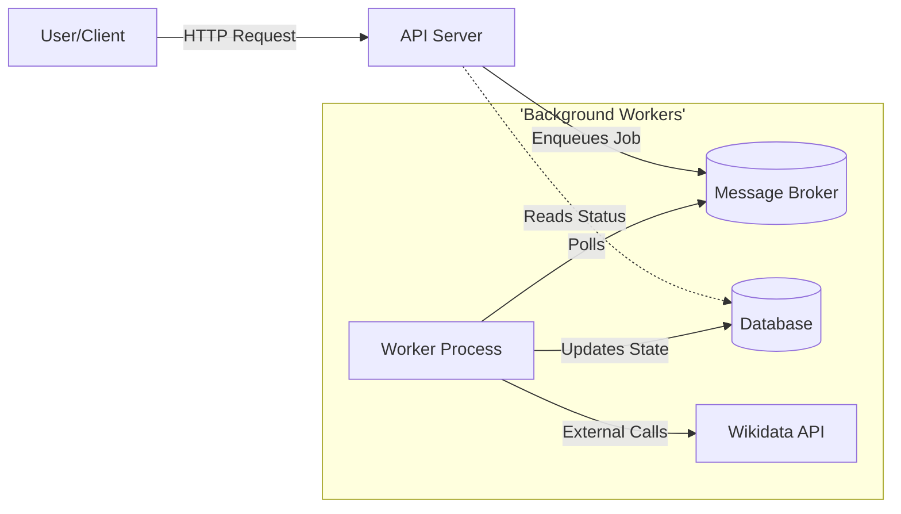

# Background Processing Architecture

## 1. Overview

This document outlines the architecture for the background processing system of the Record Linker. The goal is to decouple time-consuming operations (like external API calls and large data processing) from the user-facing HTTP API to ensure responsiveness and scalability.

The system follows a classic **Producer-Consumer** pattern using a persistent **Message Broker**.

### High-Level Architecture



---

## 2. Core Components

### 2.1 The Message Broker (Queue)
Acts as the intermediary buffer. It stores "Job Messages" until a worker is ready to process them.
- **Responsibility**: Durably store messages. Ensure reliable delivery.
- **Queues**:
    - `high_priority`: For user-initiated single-item actions (e.g., "Retry this task now").
    - `default`: For bulk operations (e.g., "Process entire dataset").
    - `low_priority`: For background maintenance or non-urgent analytics.

### 2.2 The Job (Task)
A serializable unit of work. It contains everything needed to execute the action.
- **Structure**:
    ```json
    {
      "job_id": "uuid-1234",
      "type": "find_matches",
      "payload": {
        "task_id": 105,
        "entry_data": { "name": "Douglas Adams", "dob": "1952-03-11" }
      },
      "metadata": {
        "user_id": 42,
        "retries": 0
      }
    }
    ```
- **Idempotency**: Jobs must be designed to be safely re-runnable. If a worker crashes mid-process, the job will be re-delivered. The implementation must handle this (e.g., checking if a result already exists before writing).

### 2.3 The Worker
A standalone process that executes jobs.
- **Lifecycle**:
    1.  Connect to Broker.
    2.  Wait/Poll for message.
    3.  **Reserve** message (prevent others from taking it).
    4.  Execute logic (e.g., call Wikidata).
    5.  **Ack** (Acknowledge) message upon success -> Broker deletes it.
    6.  **Nack** (Negative Ack) upon failure -> Broker re-queues it for retry.

### 2.4 State Store (Database)
The source of truth for the UI. Workers update the database manifest process.
- The API *never* waits for the Worker.
- The Worker *updates* the API's view of the world (e.g., changing Task Status from `PENDING` to `COMPLETED`).

---

## 3. Data Flow: "Match Candidate Generation"

This is the primary workflow: searching Wikidata for a Dataset Entry.

### Step-by-Step Flow

1.  **Trigger**: User clicks "Start Project" or "Rerun Task".
2.  **API Layer**:
    -   Validates request.
    -   Updates Task status in DB to `PENDING` or `QUEUED`.
    -   Creates a Job Message (`type="match_entry", task_id=123`).
    -   Pushes message to Broker.
    -   Returns `202 Accepted` to User.
3.  **Broker**: Holds the message in the `default` queue.
4.  **Worker**:
    -   Picks up message.
    -   **Fetch**: Reads `Task` and `DatasetEntry` from DB using `task_id`.
    -   **Execution**:
        1.  Calls `WikidataService.search_entities(entry.name)`.
        2.  For each result, calls `WikidataService.get_entity(qid)` (or batch fetch).
        3.  Runs `MatchingService` to score each candidate.
    -   **Persistence**:
        -   Creates rows in `match_candidates` table.
        -   Updates `tasks` table: status=`REVIEW`, `candidate_count=5`.
    -   **Completion**: Acks the message.
5.  **User UI**: Polls endpoint (or receives WebSocket event) showing Task moved to `Review`.

---

## 4. Specific Workflows

### 4.1 Batch Processing (Fan-Out)

When starting a project with 10,000 entries, we don't create one giant job. We use a **Fan-Out** pattern.

1.  **Project Start Job**: A single job runs.
2.  **Fan-Out**: This job queries the DB for all relevant `dataset_entries`.
3.  **Enqueue**: It pushes 10,000 individual `match_entry` jobs to the queue.
    -   *Benefit*: High parallelism. If one fails, only one fails. Multiple workers can chew through the backlog in parallel.

### 4.2 Data Import

Handling large CSV uploads.

1.  **Upload**: User uploads file. API streams it to shared storage (S3/Volume).
2.  **Job**: `import_dataset` job created with `file_path`.
3.  **Worker**:
    -   Streams file row-by-row.
    -   Validates schema.
    -   Batch inserts into DB (e.g., every 1,000 rows).
    -   Updates `dataset.row_count` progress periodically.

---

## 5. Design Patterns & Reliability

### 5.1 Race Conditions
*Problem*: User cancels a task while worker is halfway through.
*Solution*: Worker checks DB status before saving.
- Check 1: Start of job. Is status still `QUEUED/PENDING`?
- Check 2: Before writing candidates. Is status `CANCELLED`?
If Cancelled, abort and Ack message (effectively dropping it).

### 5.2 Rate Limiting (Throttling)
Wikidata has rate limits.
- **Worker-side**: Workers use a token bucket or semaphore to limit outgoing requests/sec.
- **Architecture-side**: Configure the Queue to only dispense N jobs per second, or limit the number of concurrent worker processes.

### 5.3 Retries
- **Transient Failures** (Network blip): Retry immediately or with linear backoff (1s, 2s, 3s).
- **Persistent Failures** (Bug in code): Move to **Dead Letter Queue (DLQ)** after N attempts. DLQ allows developers to inspect failed payloads without blocking the main queue.

---

## 6. Implementation Plan (Phase X)

Since we are avoiding specific tech in the design, here is how we map it to code:

1.  **Interface Definition**:
    Define a generic `JobDispatcher` protocol in Python.
    `class JobDispatcher: async def enqueue(job_name, **kwargs)`
2.  **Job Registry**:
    A mapping of job names to functions.
    `JOBS = {"match_entry": process_match_entry}`
3.  **Worker Entrypoint**:
    A management command (e.g., `python manage.py runworkers`) that initializes the consumer loop.

This architecture ensures robust, scalable, and resilient background processing suitable for high-volume record linkage.
